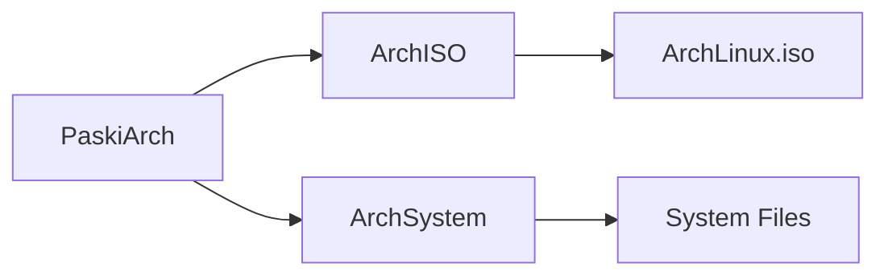

# Table of Contents

- [Installing ArchLinux](#installing-archlinux)
    - [Overview](#overview)
    - [Download the system image](#download-the-system-image)
    - [Let's Start! Creating the VM](#lets-start-creating-the-vm)
    - [How to distribute the disk](#how-to-distribute-the-disk)
    - [Getting hands dirty](#getting-hands-dirty)
        - [Keyboard Distribution](#keyboard-distribution)
        - [Disk partitioning](#disk-partitioning)
            - [Format the partitions](#format-the-partitions)
            - [Mounting the partitions](#mounting-the-partitions)
        - [Installing the OS](#installing-the-os)
            -[Generate the fstab](#generate-the-fstab)
    - [Configuring the basics](#configuring-the-basics)
        - [Entering the system](#entering-the-system)
        - [Configuring](#configuring)
            - [Hostname](#hostname)
            - [Localtime](#localtime)
            - [Language](#language)
            - [Start the hardware clock](#start-the-hardware-clock)
            - [Configuring the keyboard layout](#configuring-the-keyboard-layout)
            - [Install grub](#install-grub)
            - [Update grub](#update-grub)
            - [Put an administrator password](#put-an-administrator-password)
            - [Create a user](#create-a-user)
        - [Unmounting the partitions](#unmounting-the-partitions)
    - [First login](#first-login)
        - [Enabling the network service](#enabling-the-network-service)
        - [First system update](#first-system-update)
        - [Installing Xorg](#installing-xorg)

# Installing ArchLinux

## Overview

We must ask us a question, where are we going to mount our OS. In a Virtual Machine? A new disk? On a partition? In my case, I'm going to install it in VMware for some reasons.

- Easy to execute while doing another things in my OS at college.
- Improved cybersecurity (if you know how to make it secure).
- If I screw up something I still have an OS, to continue my work, instead of losing my entire work.
- I want to test this system until I'm prepared for replace it for my current OS.

Also there is something that we'll discuss later.

## Download the system image
If we want to install ArchLinux we must download the .ISO file. So let's go to the [ArchLinux](https://archlinux.org/download/) website.

Then we choose the best option for us. I must recommend to download [qBittorent](https://www.qbittorrent.org/download.php) and use the Torrent option because all times I've downloaded the image seems to be very fast.

## Let's Start! Creating the VM

First we are going to configure the machine. So here is a table of the components I've added to the VM.

| Components | Specs  |
| :---: | :---: |
| Memory | 4 GB |
| Processors | 2 |
| SSD | 420 GB |

Then we are going to include our image to the VM. If you are going to install it for your computer you can still follow my guide, it seems to work perfectly.
The counterpart of following this guide if you're installing this system without a VM it could be that some utilities like a USB port will not function correctly, because you need the specific software or packages.

## How to distribute the disk
It could be possible that you want to store more data than the VM, just create a partition that covers the full disk and create folders organizing your data.
You'll need one for the system, just remember that.

The next scheme is how my disk is distributed:



## Getting hands dirty

Time to get started of the installation of ArchLinux. You'll have the "username@hostname ~ $" structure in the tutorial, if you want just the commands please, just copy it.

### Keyboard Distribution

If we are using a keyboard layout different from the US layout, we'll change it with the next command,
in my case I'm using a spanish layout, so:

```console
root@archiso ~ # loadkeys es
```

If you don't know how your layout is called, put this command to see the list of layouts:
```console
root@archiso ~ # localectl list-keymaps | less
```

### Disk partitioning
So let's play with the real game. Just put the next:
```console
root@archiso ~ # cfdisk
```

With this we will see a little window asking us which type of disk will be, it doesn't matter because we can change it after with:
```console
root@archiso ~ # fdisk /dev/sda
```

In my case I'll be choosing DOS. I'm making everything from the start like in a fresh computer, but in a Virtual Machine.
If you want to change your type do the next:

**GPT Partition**
```console
root@archiso ~ # fdisk /dev/sda
root@archiso ~ # g
root@archiso ~ # w
```

**DOS Partition**
```console
root@archiso ~ # fdisk /dev/sda
root@archiso ~ # o
root@archiso ~ # w
```

So let's going with our real command:
```console
root@archiso ~ # cfdisk
```

We are going to create **4 partitions**.
One for the **boot**, another for the **root**, the **swap** and the **home**.

I've got a rule that configures the amount of space required.

**NOTICE:** The amount of space for the **root** and **home** partition is calculed after
discouting the sum of **/boot** and **/swap**.

| Partition | Space (Maximum) |
| --- | --- |
| /boot | 2GB |
| /root | 30% |
| /swap | 10GB |
| /home | 70% |

So our partition will be like the next table:

| Device | Bootable | Start | End | Sectors | Size | Id | Type |
| --- | --- | --- | --- | --- | --- | --- | --- |
| /dev/sda1 | * | 2048 | 4196351 | 4194304 | 2G | 83 | Linux |
| /dev/sda2 |  | 4196352 | 255854591 | 251658240 | 120G | 83 | Linux |
| /dev/sda3 |  | 255854592 | 276826111 | 20971520 | 10G | 82 | Linux swap / Solaris |
| /dev/sda4 |  | 276826112 | 880803839 | 603977728 | 288G | 83 | Linux |

Then we click on **[ Write ]** and enter "yes".
We **[ Quit ]**.

#### Format the partitions

In the first case, we'll have the boot:
```console
root@archiso ~ # mkfs.ext2 /dev/sda1
```
Then the root and home:
```console
root@archiso ~ # mkfs.ext2 /dev/sda2
root@archiso ~ # mkfs.ext2 /dev/sda4
```
Next the swap:
```console
root@archiso ~ # mkswap /dev/sda3
root@archiso ~ # swapon /dev/sda3
```

#### Mounting the partitions

For making the install of the OS we have to mount the partitions.
So let's get started.

First the root:
```console
root@archiso ~ # mount /dev/sda2 /mnt
```

Next we're going to make two folders:
```console
root@archiso ~ # mkdir /mnt/home
root@archiso ~ # mkdir /mnt/boot
```

And pass them to the boot and the home directories:
```console
root@archiso ~ # mount /dev/sda1 /mnt/boot
root@archiso ~ # mkdir /dev/sda4 /mnt/home
```

### Installing the OS

I'm going to install some packages from outside:
```console
root@archiso ~ # pacstrap /mnt base base-devel grub os-prober ntfs-3g networkmanager gvfs gvfs-afc gvfs-mtp xdg-user-dirs linux linux-firmware nano dhcpcd
```

The only packages that I think could be optional in a VM are:
- gvfs-afc (this allows us to mount an iphone)
- gvfs-mtp (this allows us to mount an android)
- ntfs-3g (detects the windows partition)
- os-prober (detect other OS)

#### Generate the fstab

We'll generate a file needed to load and store the info about the generated partitions. So let's put this command:
```console
root@archiso ~ # genfstab -pU /mnt >> /mnt/etc/fstab
```

Now let's configure Arch!

## Configuring the basics

Just like it sounds, the basics. Now we'll learn how I'm going to configure a basic Unix System.
Depending on which use we'll make we can configure in a different way.

### Entering the system

When we began the installation we where on a default console, but for installing the system we must
get access to the OS through a new console. Using:
```console
root@archiso ~ # arch-chroot /mnt
```

### Configuring
#### Hostname
If we want to change the hostname we can put this command with the new name:
```console
[root@archiso /]# echo hostname > /etc/hostname
```

In my case I'll be using a name from a norse god:
```console
[root@archiso /]# echo odin > /etc/hostname
```

#### Localtime
We can choose what time to put. Normally I'll be choosing Europe/Madrid to get the same time from my country, but because I'm recently learning japanese I'll be using that time:
```console
[root@archiso /]# ln -sf /usr/share/zoneinfo/Asia/Tokyo /etc/localtime
```

If you cannot find your time you can check this command:
```console
[root@archiso /]# ls /usr/share/zoneinfo
```

#### Language
With the next command we will change the language of our system. In this case I'll be using English instead of Spanish.
```console
[root@archiso /]# nano /etc/locale.gen
```

This will open a list with codes like this **en_US**. I will uncomment a line named **en_US.UTF-8 UTF-8**.
After that I'll be putting manually on the system config.
```console
[root@archiso /]# echo LANG=en_US.UTF-8 > /etc/locale.conf
```

#### Start the hardware clock
Let's adjust the internal clock:
```console
[root@archiso /]# hwclock -w
```

#### Configuring the keyboard layout
For the inner system we must configure the layout.
```console
[root@archiso /]# echo KEYMAP=es > /etc/vconsole.conf
```

You must know that when we install the graphic package we must reconfigure this part.

#### Install grub
If you're not very familiar with grub, is just a bootloader. So let's install it.
```console
[root@archiso /]# grub-install /dev/sda
```

#### Update grub
If we want to update grub just put the next command, I recommend it to do it, for not having errors later:
```console
[root@archiso /]# grub-mkconfig -o /boot/grub/grub.cfg
```

#### Put an administrator password
We're close to finish the basic installation. Let's put a password for the user root. I usually recommend to block direct access to root after the first login but it's up to you.
```console
[root@archiso /]# passwd
```

#### Create a user
Creating a new user for login, instead of root.
```console
[root@archiso /]# useradd -m -g users -G audio,lp,optical,storage,video,wheel,games,power,scanner -s /bin/bash username
```

I'll be using a different name like "thor", so you could see the difference.
```console
[root@archiso /]# useradd -m -g users -G audio,lp,optical,storage,video,wheel,games,power,scanner -s /bin/bash thor
```

So then we change the password of our new user:
```console
[root@archiso /]# passwd thor
```

Then we quit from the mounted partition.
```console
[root@archiso /]# exit
```

### Unmounting the partitions
It's time to undo what we made earlier, unmount the partitions. Time to test our new system.
We must be able to unmount all partitions with:
```console
root@archiso ~ # umount -R /mnt
```

But if we are getting troubles, we'll do it one by one:
```console
root@archiso ~ # umount /mnt/boot
root@archiso ~ # umount /mnt/home
root@archiso ~ # umount /mnt
```

Time for a reboot!
```console
root@archiso ~ # reboot
```

## First login
We will be **login** using **root** as first login, to change some things before the graphic update.
Let's edit the sudoers file to put our new user.
```console
root@odin ~ # nano /etc/sudoers
```

And we check for a line that is commented, then remove the "#":
```console
%wheel ALL=(ALL:ALL) ALL
```

### Enabling the network service
Time to get access to Internet.
```console
root@odin ~ # systemctl start NetworkManager.service
root@odin ~ # systemctl enable NetworkManager.service
```

Then we exit with:
```console
root@odin ~ # exit
```

### First system update
Time to make the first system update! Just login with your user.
```console
thor@odin ~ $ sudo pacman -Syu
```

### Installing Xorg
It's important that if we want to create graphic environments we use Xorg. This helps us to create a bridge between the hardware and the software we want to run.
```console
thor@odin ~ $ sudo pacman -Sy xorg
```

# Customizing ArchLinux
## Creating a graphic environment
Now we have a system in terminal, unless you really like this kind of desktop it's not the best to work. So I'll install lightdm, with a greeter (you need a greeter to run lightdm), qtile for work with a tiling system instead of floating windows, xterm as a terminal (temporary) and neovim as a code editor (I really like vim and neovim it's magic).
```console
thor@odin ~ $ sudo pacman -S lightdm lightdm-gtk-greeter qtile xterm neovim
```

After these packages I want to install a browser to navigate through Internet. People usually download firefox, in my case I'll install brave. For install brave we will need yay a package manager.
```console
thor@odin ~ $ sudo pacman -S --needed git base-devel
thor@odin ~ $ git clone https://aur.archlinux.org/yay.git
thor@odin ~ $ cd yay
thor@odin ~ $ makepkg -si
```
Then it's time to install our browser.
```console
thor@odin ~ $ yay -S brave
```
